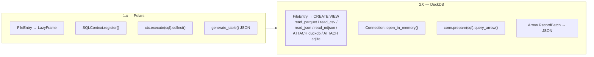

# TableViewer 2.0.0 — Migration Plan: Polars → DuckDB

## Motivation

| | Polars 0.40 (current) | DuckDB 1.x (target) |
|---|---|---|
| SQL dialect | Polars SQL (subset) | Full DuckDB SQL — CTEs, window functions, PIVOT, UNPIVOT, QUALIFY, … |
| File formats | parquet, arrow/ipc, csv, json, jsonl | All above + **DuckDB**, **SQLite**, glob patterns (`*.parquet`) |
| JSON/JSONL | Custom Rust reader | Native `read_json` / `read_ndjson` |
| Column names | Must sanitise hyphens → underscores | Standard quoted identifiers, no sanitisation |
| Type system | Polars dtype | DuckDB SQL types (BIGINT, VARCHAR, LIST, STRUCT, MAP, …) |
| Schema | LazyFrame schema | `DESCRIBE table` / `information_schema` |
| Export | ParquetWriter / CsvWriter | `COPY (sql) TO 'file' (FORMAT parquet/csv)` |
| Build size | ~30MB Polars compile | Similar (bundled DuckDB via cc crate) |

---

## Architecture delta



---

## Scope of changes

### 1. `src-tauri/Cargo.toml`

```toml
# REMOVE
polars = { version = "0.40.0", features = [...] }

# ADD
duckdb = { version = "~1.10504.0", features = ["bundled", "parquet"] }
```

No other Rust dependencies change.

---

### 2. `src-tauri/src/main.rs` — complete rewrite

#### 2a. Connection builder (replaces `build_context`)

```rust
use duckdb::{Connection, params};

fn build_connection(entries: &[FileEntry]) -> Result<Connection, String> {
    let conn = Connection::open_in_memory()
        .map_err(|e| e.to_string())?;

    for entry in entries {
        let ddl = entry_to_view_ddl(entry)
            .map_err(|e| e.to_string())?;
        conn.execute_batch(&ddl)
            .map_err(|e| e.to_string())?;
    }
    Ok(conn)
}
```

#### 2b. View DDL generator (replaces `entry_to_lf`)

```rust
fn entry_to_view_ddl(entry: &FileEntry) -> Result<String, String> {
    let files_list = entry.filenames.iter()
        .map(|f| format!("'{}'", f.replace('\'', "''")))
        .collect::<Vec<_>>()
        .join(", ");

    let select = match entry.filetype.as_str() {
        "parquet" =>
            format!("SELECT * FROM read_parquet([{files_list}])"),

        "arrow" =>
            // DuckDB reads Arrow IPC / Feather via read_parquet with format hint
            // or via the arrow scanner; fall back to read_parquet for now
            format!("SELECT * FROM read_parquet([{files_list}])"),

        "csv" => {
            let sep = entry.sep.unwrap_or(b',') as char;
            format!("SELECT * FROM read_csv([{files_list}], \
                     delim='{sep}', header=true, auto_detect=true)")
        }

        "json"  =>
            format!("SELECT * FROM read_json([{files_list}], auto_detect=true)"),

        "jsonl" =>
            format!("SELECT * FROM read_ndjson([{files_list}], auto_detect=true)"),

        "duckdb" => {
            // ATTACH the file then expose its default schema
            let path = &entry.filenames[0].replace('\'', "''");
            let db_alias = format!("__db_{}", entry.alias);
            return Ok(format!(
                "ATTACH '{path}' AS {db_alias} (READ_ONLY);\
                 CREATE VIEW {alias} AS SELECT * FROM {db_alias}.main;",
                alias = entry.alias
            ));
        }

        "sqlite" => {
            let path = &entry.filenames[0].replace('\'', "''");
            let db_alias = format!("__sq_{}", entry.alias);
            return Ok(format!(
                "INSTALL sqlite; LOAD sqlite;\
                 ATTACH '{path}' AS {db_alias} (TYPE SQLITE, READ_ONLY);\
                 CREATE VIEW {alias} AS SELECT * FROM {db_alias};",
                alias = entry.alias
            ));
        }

        other => return Err(format!("unknown filetype: {other}")),
    };

    Ok(format!("CREATE VIEW {} AS {};", entry.alias, select))
}
```

#### 2c. Query execution (replaces `execute_query`)

```rust
#[tauri::command]
fn execute_query(entries_json: &str, sql: &str) -> String {
    let entries = match parse_entries(entries_json) { Ok(e) => e, Err(s) => return s };
    let conn    = match build_connection(&entries)   { Ok(c) => c, Err(e) => return err_json(&e) };

    // Add row index (DuckDB: rowid or ROW_NUMBER())
    let wrapped = format!(
        "SELECT ROW_NUMBER() OVER () AS idx, * FROM ({sql}) __q"
    );

    let mut stmt = match conn.prepare(&wrapped) {
        Ok(s) => s, Err(e) => return err_json(&e.to_string()),
    };

    let col_names: Vec<String> = stmt.column_names()
        .iter().map(|s| s.to_string()).collect();

    let rows_result: duckdb::Result<Vec<_>> = stmt
        .query_map([], |row| {
            let mut map = std::collections::HashMap::new();
            for (i, name) in col_names.iter().enumerate() {
                let val: duckdb::types::Value = row.get(i)?;
                map.insert(name.clone(), value_to_string(&val));
            }
            Ok(map)
        })
        .and_then(|mapped| mapped.collect());

    match rows_result {
        Ok(body) => generate_table_from_rows(&col_names, body),
        Err(e)   => err_json(&e.to_string()),
    }
}
```

#### 2d. Schema (replaces `get_schema`)

```rust
#[tauri::command]
fn get_schema(entries_json: &str) -> String {
    let entries = match parse_entries(entries_json) { Ok(e) => e, Err(s) => return s };
    let conn    = match build_connection(&entries)   { Ok(c) => c, Err(e) => return err_json(&e) };

    let mut tables = Vec::new();
    for entry in &entries {
        let sql = format!(
            "SELECT column_name, data_type \
             FROM information_schema.columns \
             WHERE table_name = '{}' ORDER BY ordinal_position",
            entry.alias
        );
        let cols: Vec<serde_json::Value> = conn
            .prepare(&sql).unwrap()
            .query_map([], |row| {
                Ok(serde_json::json!({
                    "name":  row.get::<_, String>(0)?,
                    "dtype": row.get::<_, String>(1)?,
                }))
            }).unwrap()
            .filter_map(|r| r.ok())
            .collect();

        tables.push(serde_json::json!({ "alias": entry.alias, "columns": cols }));
    }
    serde_json::json!({ "ok": true, "tables": tables }).to_string()
}
```

#### 2e. Export (replaces `export_parquet` / `export_csv_file`)

```rust
#[tauri::command]
fn export_parquet(entries_json: &str, sql: &str, dest: &str) -> String {
    let entries = match parse_entries(entries_json) { Ok(e) => e, Err(s) => return s };
    let conn    = match build_connection(&entries)   { Ok(c) => c, Err(e) => return err_json(&e) };

    let copy_sql = format!("COPY ({sql}) TO '{dest}' (FORMAT PARQUET)");
    match conn.execute_batch(&copy_sql) {
        Ok(_)  => serde_json::json!({ "ok": true }).to_string(),
        Err(e) => err_json(&e.to_string()),
    }
}

#[tauri::command]
fn export_csv_file(entries_json: &str, sql: &str, dest: &str, sep: u8) -> String {
    let entries = match parse_entries(entries_json) { Ok(e) => e, Err(s) => return s };
    let conn    = match build_connection(&entries)   { Ok(c) => c, Err(e) => return err_json(&e) };

    let delim = sep as char;
    let copy_sql = format!("COPY ({sql}) TO '{dest}' (FORMAT CSV, DELIMITER '{delim}', HEADER)");
    match conn.execute_batch(&copy_sql) {
        Ok(_)  => serde_json::json!({ "ok": true }).to_string(),
        Err(e) => err_json(&e.to_string()),
    }
}
```

#### 2f. Remove entirely
- `sanitize_column_name` / `sanitize_lf` — DuckDB handles quoted identifiers natively
- `json_column_to_series` / `objects_to_df` / `read_json_objects` — replaced by `read_json`/`read_ndjson`
- `check_json_import` command — DuckDB validates JSON natively on first query; remove from frontend too

---

### 3. `src/types.ts` — new filetype union

```ts
// BEFORE
filetype: 'parquet' | 'arrow' | 'csv' | 'json' | 'jsonl'

// AFTER
filetype: 'parquet' | 'arrow' | 'csv' | 'json' | 'jsonl' | 'duckdb' | 'sqlite'
```

---

### 4. `src/composables/useFiles.ts`

```ts
// ADD to FILETYPE_OPTIONS
{ label: 'DuckDB',  key: 'duckdb'  },
{ label: 'SQLite',  key: 'sqlite'  },

// ADD to Extensions
duckdb: ['duckdb', 'db'],
sqlite: ['sqlite', 'db', 'sqlite3'],

// REMOVE: check_json_import invoke block (DuckDB validates on execute)
// REMOVE: CSV modal for JSON — just call add_entry directly

// typeColor additions in AppSidebar.vue:
if (ft === 'duckdb') return 'warning'
if (ft === 'sqlite') return 'default'
```

---

### 5. Column sanitisation — remove everywhere

DuckDB uses standard SQL identifier quoting. Column names with hyphens, spaces, etc. work naturally. Remove the `sanitize_lf` / `sanitize_column_name` Rust functions and any frontend references to them.

---

## New capabilities unlocked by DuckDB

| Feature | Example SQL |
|---|---|
| Window functions | `SELECT *, ROW_NUMBER() OVER (PARTITION BY type ORDER BY score DESC) AS rank FROM t` |
| CTEs | `WITH top AS (SELECT * FROM t LIMIT 10) SELECT * FROM top` |
| PIVOT | `PIVOT t ON category USING SUM(score)` |
| Glob multi-file | Open `*.parquet` as a single alias |
| DESCRIBE | `DESCRIBE alias` |
| Sampling | `SELECT * FROM t USING SAMPLE 5%` |
| Full-text search | `SELECT * FROM t WHERE CONTAINS(text, 'boulangerie')` |
| JSON path | `SELECT data->>'$.name' FROM t` |
| Read remote | `SELECT * FROM read_parquet('https://...')` |

---

## Risks & mitigations

| Risk | Mitigation |
|---|---|
| `bundled` adds ~2 min to first compile | Accept; subsequent builds use Cargo cache |
| Arrow IPC read support | Test `read_parquet` with `.arrow` files; fallback to explicit Arrow IPC reader if needed |
| SQLite ATTACH requires network for `INSTALL sqlite` | Pre-bundle the sqlite extension via `bundled-cmake,sqlite` feature flag if available |
| DuckDB `.db` extension collides with SQLite `.db` | Detect magic bytes at open time, or ask user which type |
| Multi-threaded Tauri commands share connection | Use one `Connection::open_in_memory()` **per command call** (stateless, thread-safe) |

---

## Milestone breakdown

| # | Milestone | Files touched |
|---|---|---|
| M1 | Swap `Cargo.toml`, confirm `cargo build` | `Cargo.toml` |
| M2 | Implement `build_connection` + view DDL for parquet/csv/json/jsonl | `main.rs` |
| M3 | Port `execute_query` + `get_schema` | `main.rs` |
| M4 | Port `export_parquet` + `export_csv_file` | `main.rs` |
| M5 | Remove sanitisation + JSON pre-scan | `main.rs`, `useFiles.ts` |
| M6 | Add DuckDB + SQLite file types to frontend | `types.ts`, `useFiles.ts`, `AppSidebar.vue` |
| M7 | Test all existing formats, fix regressions | All |
| M8 | Bump version → 2.0.0, update README/CHANGELOG | `tauri.conf.json`, `package.json`, docs |
