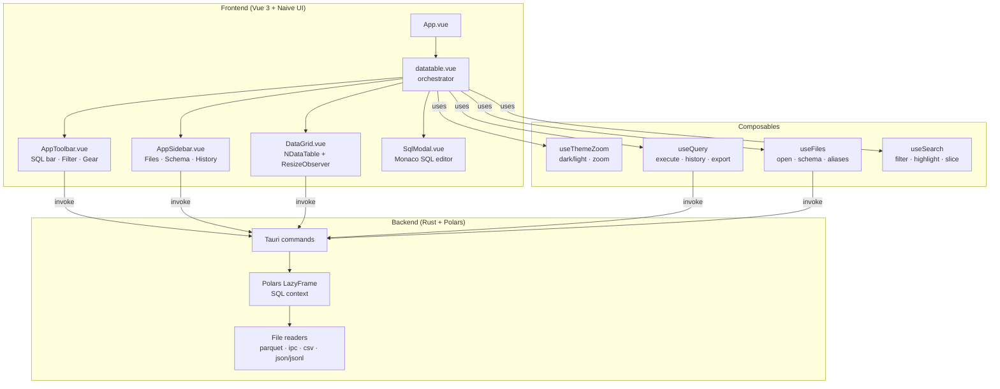

# TableViewer

A cross-platform desktop table viewer built with **Tauri v2 + Vue 3 + Polars**.  
Open parquet, Arrow/IPC, CSV, JSON and JSONL files, query them with SQL (including cross-file JOINs), filter results, and export — all offline.


---

## Features

### File formats
| Format | Extensions | Notes |
|---|---|---|
| Parquet | `.parquet` | single or multi-file scan |
| Arrow / Feather | `.arrow`, `.ipc`, `.feather` | single or multi-file scan |
| CSV | `.csv` | configurable delimiter (`,` `;` `\t`) |
| JSON | `.json` | array-of-objects **or** object-of-arrays |
| JSONL / NDJSON | `.jsonl`, `.ndjson` | one object per line; mismatched keys warned and discarded |

### SQL engine
- Full **Polars SQL** — `SELECT`, `WHERE`, `GROUP BY`, `ORDER BY`, `LIMIT`, `JOIN` …
- Open multiple files simultaneously, each with an editable **SQL alias**
- Cross-file JOINs (`SELECT a.*, b.score FROM coverage a JOIN qa b ON …`)
- Column names are automatically sanitised (hyphens → underscores) for SQL compatibility
- Press **Enter** or click **▶** to execute; **Ctrl+Enter** inside the Monaco modal

### SQL editor
- Inline single-line SQL bar (always visible)
- **⤢ expand** button opens a full **Monaco editor modal** with SQL syntax highlighting (offline — no CDN)
- Query **history** (last 10 queries, exportable as `.sql`, click to re-run)

### Filter & search
- **Full-text** (`T`), **fuzzy** (`≈`) and **regex** (`.*`) modes
- Matched text is **highlighted** in every cell
- Filter runs client-side on the current result set

### Pagination & shape bar
- Shape bar always visible: **`N rows × M cols`** · page navigation · **`X/page`**
- Rows per page: 100 / 200 / 500 / 1000 (gear menu)
- **Double-click any row-number cell** to copy the full row as formatted JSON

### Export
- **Parquet** export of any query result
- **CSV** export with delimiter selection

### UI / UX
- Dark / light theme toggle
- Sidebar: file list with type badges + editable aliases, collapsible schema view per table, query history
- Sidebar can be collapsed (☰)
- **Ctrl +** / **Ctrl −** / **Ctrl 0** for zoom in / out / reset

---

## Architecture



---

## Platform support

| Platform | Status | How to get it |
|---|---|---|
| **Linux** | ✅ | `cargo tauri build` or [Releases](https://github.com/tanguy-launay/TableViewer/releases) |
| **Windows** | ✅ | `cargo tauri build` or [Releases](https://github.com/tanguy-launay/TableViewer/releases) |
| **macOS** | ✅ | `cargo tauri build` or [Releases](https://github.com/tanguy-launay/TableViewer/releases) |

---

## Build from source

### Prerequisites

| Tool | Version |
|---|---|
| Rust | ≥ 1.77 |
| Bun | ≥ 1.0 |
| Tauri CLI | v2 (`cargo install tauri-cli --version "^2"`) |

### Steps

```bash
git clone https://github.com/tanguy-launay/TableViewer.git
cd TableViewer

# Install JS dependencies
bun install

# Development (hot-reload)
cargo tauri dev

# Production build
cargo tauri build
```

The release binary is placed at `src-tauri/target/release/tableviewer` (Linux/macOS) or `src-tauri/target/release/tableviewer.exe` (Windows).  
Installers (`.deb`, `.AppImage`, `.msi`, `.dmg`) are in `src-tauri/target/release/bundle/`.

---

## Key dependencies

| Layer | Crate / Package | Role |
|---|---|---|
| Backend | `polars 0.40` | DataFrame engine + SQL context |
| Backend | `tauri ~2.11` | Native window + IPC |
| Backend | `serde_json` | JSON serialisation |
| Frontend | `vue 3` | Reactive UI |
| Frontend | `naive-ui 2.38` | Component library |
| Frontend | `monaco-editor 0.55` | SQL editor modal (SQL bundle only) |
| Frontend | `@guolao/vue-monaco-editor` | Vue wrapper for Monaco |
| Frontend | `vite-plugin-monaco-editor` | Offline Monaco worker bundling |
